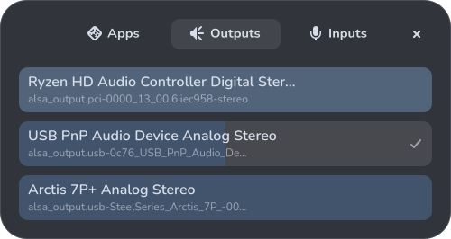

# Ovolay

A gtk4-layer-shell volume overlay.

  

This brings most functions of a program like `pavucontrol` to an overlay you can access on top of videos and games.

### Keyboard shortcuts

All modes are selected by default, but you can use a specific one with `--binds`.

| vim    | wasd    | udlr | Function        |
| ------ | ------- | ---- | --------------- |
| k      | w       | ↑    | Up selection    |
| j      | s       | ↓    | Down selection  |
| h      | a       | ←    | Decrease volume |
| l      | d       | →    | Increase volume |

These shortcuts are universal, regardless of the selected mode.

| Key           | Function                       |
| -----------   | -----------                    |
| q             | Close window                   |
| Esc           | Close window                   |
| Enter         | Select default input/output    |
| m             | Toggle mute                    |
| Space         | Toggle mute                    |
